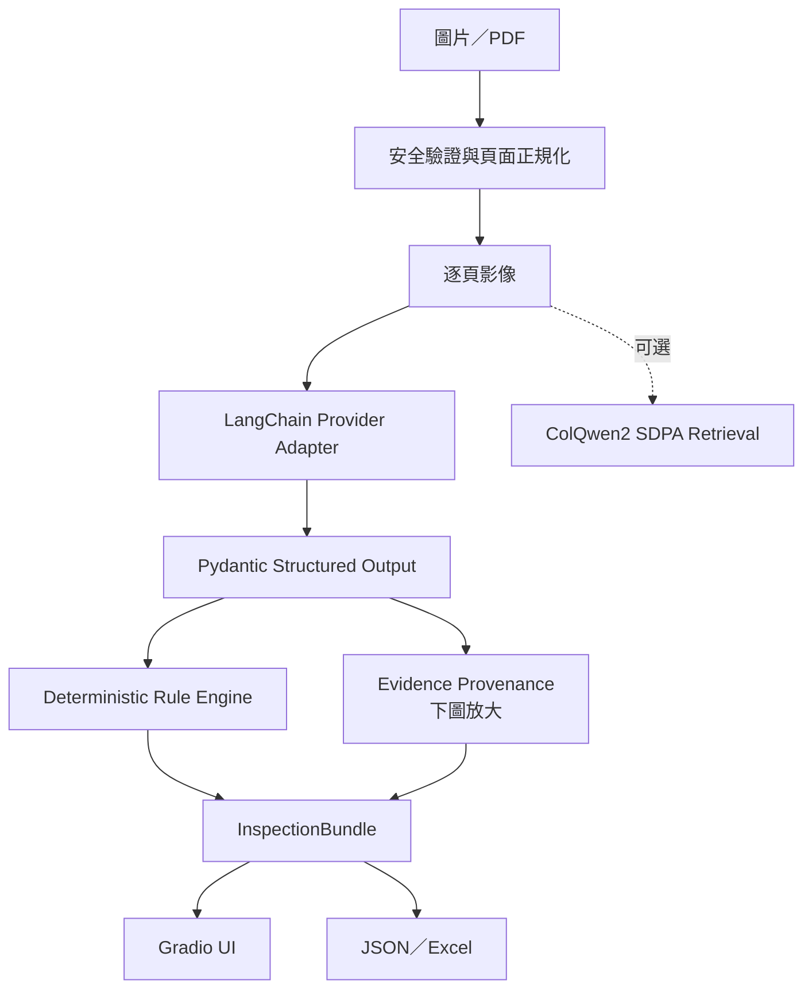
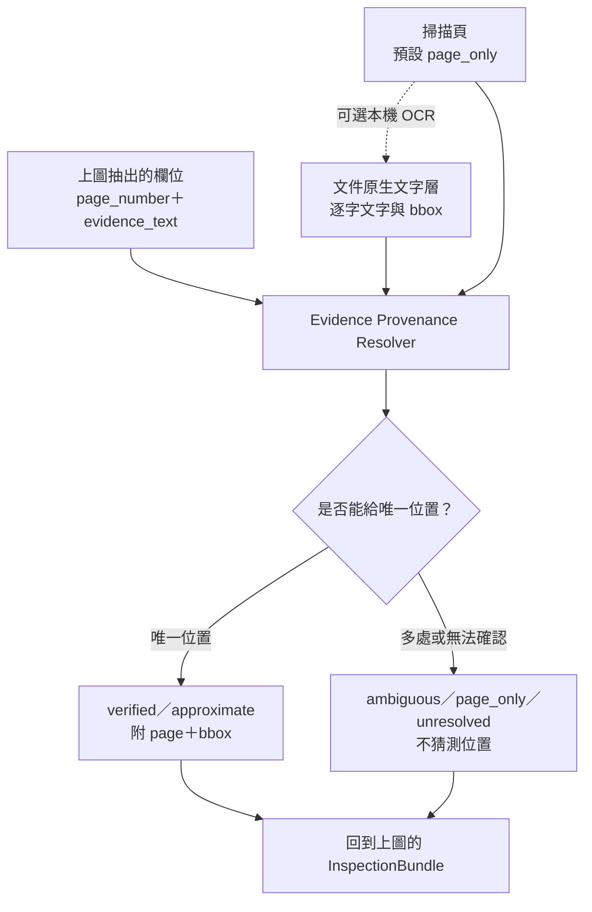

# Doc Inspector｜文件預檢所

[](https://github.com/kuotunyu/doc-inspector/actions/workflows/ci.yml)
[](https://www.python.org/)
[](LICENSE)
[](https://steven0226-doc-inspector.hf.space)

**把 VLM 文件抽取，做成一套證據可追溯、規則可測試、發布可驗證的文件預檢系統。**

我常看到補助申請真正困難的地方，不一定是不符合資格，而是欄位、日期、身分資料或金額稍有疏漏，就必須往返補件。我想先把重複而可檢查的步驟交給工具，讓申請人在送件前看懂問題、提早修正，也藉此實作一套面向台灣公共服務情境、透明且可重現的 Document AI 產品。

[**線上試用**](https://steven0226-doc-inspector.hf.space) · [**Case Study**](docs/CASE_STUDY.md) · [**來源核驗設計**](docs/EVIDENCE_PROVENANCE.md) · [**v1.1.2 Release**](https://github.com/kuotunyu/doc-inspector/releases/tag/v1.1.2)

> **v1.1.2 · Feature Freeze** — Phase 0–7 已驗收並正式發布。這是送件前技術預檢工具，不取代主管機關的資格審查。

## 可驗證成果

以下證據分開回答四件事：規則是否穩定、來源能否核驗、真實文件 extraction 效果，以及固定資料集的頁面 retrieval 效果。

| 面向 | 實測結果 | Evidence |
|---|---|---|
| 本機 release gate | **262 passed，總 coverage 91%**（實測 91.01%） | [`tests/`](tests/)／[`pyproject.toml`](pyproject.toml) |
| 跨平台 CI | Windows／Ubuntu、Python 3.11；259 passed、1 skipped、coverage 89.33% | [GitHub Actions](https://github.com/kuotunyu/doc-inspector/actions) |
| Deterministic decision | **24／24** fixed synthetic regression cases exact match | [方法](docs/DECISION_EVALUATION.md)／[JSON](docs/assets/decision-evaluation.json) |
| Synthetic provenance | 61 fields；false verified rate **0%** | [方法](docs/EVIDENCE_PROVENANCE.md)／[JSON](docs/assets/provenance-evaluation.json) |
| 真實文件 extraction | XFUND micro F1：**0.4471／0.4819** | [去識別 artifact](docs/assets/xfund-extraction-benchmark.json) |
| 視覺頁面 retrieval | Recall@1 **0.95**、Recall@3 **1.00** | [去識別 artifact](docs/assets/colqwen-retrieval-benchmark.json) |
| 發布與部署 | `1.1.2` wheel／sdist、20／20 Space 關鍵來源檔 byte-exact | [Release](https://github.com/kuotunyu/doc-inspector/releases/tag/v1.1.2)／[部署指南](docs/REMOTE_SETUP.md) |

## 產品能力

- 接受 PNG、JPEG、WebP，或最多 10 頁的 PDF。
- 以 `subsidy_application`、`receipt` 固定 schema 抽取欄位、頁碼與短證據。
- 在原始文件上核驗 evidence，區分 `verified`、`approximate`、`ambiguous`、`page_only`、`unresolved`。
- 以紅／黃／綠呈現規則結果與可操作的修正清單。
- 匯出不含絕對路徑與 raw provider response 的 JSON、五工作表 Excel。
- 提供固定 seed、明顯浮水印且不含真實個資的 synthetic demo。
- 可選本機 OCR 與 ColQwen2 視覺頁面 retrieval；核心 CPU 部署不安裝 GPU dependencies。

## 介面


選擇欄位後，可直接查看核驗狀態、頁碼與文件上的 evidence bbox；無法可靠定位時不顯示猜測位置。


## 架構

### 整體預檢流程

這張圖呈現文件從進入系統到產生報告的完整流程。



### Evidence Provenance 放大圖

> 下圖只展開上圖的 `Evidence Provenance` 節點：它接收上圖抽出的欄位與文件文字層／OCR，回傳來源核驗狀態；不是另一套預檢流程。



抽取使用 LangChain 1.x `init_chat_model(...).with_structured_output(..., include_raw=True)`，不建立 Agent loop。模型不輸出座標；bbox 由抽取後的 deterministic matching 產生，避免把模型生成的 evidence 當成已驗證來源。

## 決策層產品評估

24 個人工定義的 synthetic extraction cases 覆蓋兩個 schema、三種燈號與 13 個非綠燈 `rule_id`，結果為 **24 / 24 exact match**。案例由人工 oracle 定義，不從目前規則輸出反推；這只證明固定輸入下的 rule contract，不是 OCR／VLM accuracy。[方法與 error analysis](docs/DECISION_EVALUATION.md) · [machine-readable result](docs/assets/decision-evaluation.json)

## 來源核驗

4 份 synthetic PDF 共 61 fields，其中 51 個有 page／bbox ground truth。實測 **false verified rate 0%**、可解析欄位 page accuracy 100%、verified bbox hit rate 100%；其餘 15% 選擇不給位置，而不是猜測。這是受控語料的 resolver 評估，不代表真實版面一般化效果。[設計、威脅模型與限制](docs/EVIDENCE_PROVENANCE.md) · [machine-readable result](docs/assets/provenance-evaluation.json)

## XFUND 評估

XFUND 中文固定 100 份（50 val＋50 未調 prompt 的 train holdout），使用嚴格、重複感知的 key-value exact match：

| Model | 文件 | 成功文件 | Micro precision | Exact-match recall | Micro F1 | Macro document F1 |
|---|---:|---:|---:|---:|---:|---:|
| `gemini-3.5-flash-lite` | 100 | 100 | 0.5712 | 0.3673 | 0.4471 | 0.4584 |
| `gpt-5-mini` | 100 | 100 | 0.6384 | 0.3871 | 0.4819 | 0.4959 |

這是真實文件 extraction 證據，也顯示目前仍低於 production-grade extraction；不能直接等同實際案件可用率。[去識別 artifact](docs/assets/xfund-extraction-benchmark.json)

## ColQwen2 視覺檢索結果

XFUND val 固定 50 頁／20 queries 的 zero-shot benchmark：

| Metric | Result |
|---|---:|
| Recall@1 | 0.95 |
| Recall@3 | 1.00 |

模型主要以英文資料訓練，結果只代表這個小型固定資料集。[去識別 artifact](docs/assets/colqwen-retrieval-benchmark.json)

## 模型選型與台灣生態系對照

| 任務 | 台灣模型／生態系候選 | v1.1.2 實際基準 | 決策 |
|---|---|---|---|
| 文件 structured extraction | `taide-gemma3-12b`（Ollama） | `GEMINI_MODEL`、`OPENAI_MODEL` | 先驗證跨 provider schema；model ID 只由 `.env` 設定 |
| 視覺頁面 retrieval | 尚無已驗證的台灣 ColVision 等價模型 | `vidore/colqwen2-v1.0-hf` | Transformers、BF16、SDPA；不使用 `flash-attn` 或 faiss |
| 文字 embedding | `taide/embeddinggemma-GTAIDE-300m-2605` | `BAAI/bge-m3` 可作 baseline | v1 未建立文字 RAG，因此未納入產品路徑 |
| Reranker | 尚無已驗證的本土 reranker | `BAAI/bge-reranker-v2-m3` | v1 未啟用，只保留未來同評估集比較能力 |

## 快速開始（Windows 11／PowerShell）

需求：Python 3.11、[uv](https://docs.astral.sh/uv/)；可選 OCR 另需 Tesseract 5。

```powershell
uv sync
Copy-Item .env.example .env
# 編輯 .env，填入至少一組 provider key 與對應 model ID
uv run python app.py
```

開啟 `http://127.0.0.1:7861`。介面可直接載入紅／黃／綠 synthetic samples；載入範例不會呼叫雲端模型。

### 測試與建置

```powershell
uv sync --all-extras --all-groups
uv lock --check
uv run --all-extras pytest --cov=doc_inspector --cov-report=term --cov-fail-under=85
uv run python scripts/run_product_evaluation.py --check
uv run python scripts/run_provenance_evaluation.py --check
uv build --clear --no-build-isolation
uv run python scripts/verify_distribution.py
uv run python scripts/verify_release.py
```

預設 CI 不使用網路、API key、Tesseract 或 GPU，也不啟動對外 UI。付費 API、GPU benchmark、browser audit 與遠端檢查皆由明確腳本隔離。

### 可選本機能力

```powershell
# 掃描頁 evidence OCR
uv sync --extra local-ocr

# ColQwen2 視覺頁面 retrieval
uv sync --extra local-retrieval
uv run --extra local-retrieval python scripts/run_retrieval_demo.py
```

## 隱私與安全邊界

- UI 必須先取得 cloud consent 才能把文件送往選定 provider。
- `.env`、原始文件、benchmark、模型權重、輸出與 logs 均由 ignore 規則排除。
- 不保存 raw provider response；錯誤只保留安全摘要，不回顯文件內容或 secrets。
- 上傳與匯出檔進入 Gradio 受管 cache，每 10 分鐘與 shutdown 時清理。
- JSON／Excel 不含本機絕對路徑；Excel 停用公式與 URL 自動解析，避免 formula injection。
- 容器以 UID `10001` non-root 執行並提供 healthcheck；正式部署只透過 platform Secrets 注入金鑰。
- 公開服務的程序內 rate limit 是濫用安全網，不取代 provider 端硬性支出上限。

## 成本

2026-07-23 實跑 smoke 估算為 US$0.002697 與 US$0.004350。100 文件 × 2 providers benchmark 的 charged-or-reserved 成本為 US$0.7935165；含 smoke、校準與保守預留後，專案總記錄為 **US$0.87104350**，低於核准硬上限 US$15。實際費用仍以 provider 帳單為準。

## CPU 容器與部署

CPU image 約 357 MB，不含 Torch／Transformers／Accelerate；本機驗證為 `health=healthy`。GitHub 是 source of truth，Hugging Face Docker Space 只接收乾淨 Git archive；發布、provenance check 與復原流程見 [Remote Setup](docs/REMOTE_SETUP.md)。

## 目前限制

- 只有補助申請與收據兩個固定 schema，不包含各機關完整資格法規。
- Cloud VLM 可能誤讀手寫、低解析、旋轉或極密集表格，仍需人工核對 evidence。
- 沒有原生文字層的掃描頁預設為 `page_only`；啟用本機 OCR 才能嘗試定位。
- Synthetic provenance 的高 bbox 指標反映受控語料，不代表真實文件定位精度。
- XFUND 指標是嚴格 exact match，不能直接等同實際案件可用率。
- ColQwen2 結果來自單一固定中文資料集，且模型主要以英文資料訓練。
- 綠燈只代表目前規則未發現問題，不代表主管機關核准或法律判斷。

## Demo 資料與授權

- XFUND v1.0：CC BY-NC-SA 4.0；原始資料、圖片與逐筆輸出不提交，改由下載腳本重建。
- 政府公開表單只供本機測試；因再散布條款不一，不納入 repository 或 public demo。
- Public demo 只使用固定 seed、明顯浮水印的 synthetic documents；程式碼採 [MIT License](LICENSE)。

延伸閱讀：[Case Study](docs/CASE_STUDY.md) · [Evidence Provenance](docs/EVIDENCE_PROVENANCE.md) · [Decision Evaluation](docs/DECISION_EVALUATION.md) · [Changelog](CHANGELOG.md) · [Contributing](.github/CONTRIBUTING.md) · [Security Policy](.github/SECURITY.md)
