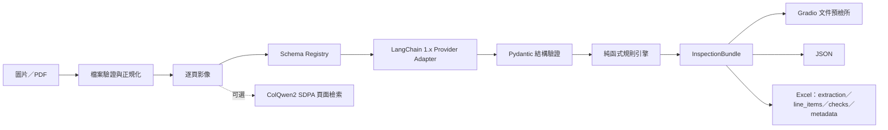

# doc-inspector｜文件預檢所

我常看到補助申請真正困難的地方，不一定是不符合資格，而是表單欄位、日期、身分資料、金額或附件稍有疏漏，就必須花時間往返補件。我想先把重複而可檢查的步驟交給工具，讓申請人在送件前看懂問題、提早修正，也藉這個專案實作一套面向台灣公共服務情境、透明、可測試且可重現的文件智慧流程。

> 目前狀態：Phase 0–6 已於 2026-07-23 完成本機工程、驗證及維護者整體驗收；[Public GitHub repository](https://github.com/kuotunyu/doc-inspector) 已建立並推送。Hugging Face Docker Space、Secrets 與公開 live demo 尚未建立。這是送件前預檢工具，不取代主管機關的正式資格審查。

## 能做什麼

- 接受 PNG、JPEG、WebP 或最多 10 頁的 PDF。
- 以 `subsidy_application` 或 `receipt` 固定 schema 抽取欄位、頁碼與短證據。
- 可切換兩個雲端供應商；模型 ID 全由 `.env` 設定。
- 以純函式規則檢查必填、日期、身分證格式與金額一致性，輸出紅／黃／綠結果。
- 下載不含本機絕對路徑與 raw API 回應的 JSON、四工作表 Excel。
- 提供固定種子、明顯浮水印且不含真實個資的合成 demo。
- 另有可選的 ColQwen2 本機視覺頁面檢索，以及不含 GPU 依賴的 CPU 容器。

## 架構



抽取路徑使用 `init_chat_model(...).with_structured_output(..., include_raw=True)`，不建立 Agent loop。PDF 由 PyMuPDF 以 200 DPI 轉圖；圖片會套用 EXIF 方向、轉成 RGB，長邊限制為 2400 px。

## 介面預覽

以下畫面由 Playwright 在本機擷取；介面採低彩度 refined civic desk，整頁只讓主要工作台形成單一浮起表面，並統一上傳、選單、告知、狀態、分頁與下載控制。桌面把標題與四步指引合併為同一 masthead，文件來源與安全範例直接放在上傳區；1440px 工作台從 y=230 開始，390px 手機則從 y=442 開始。流程輔助文字與欄位標籤至少 17px，空結果表格會明確說明資料尚未產生。主要按鈕旁持續顯示等待、處理中、錯誤或完成狀態；雲端同意預設未勾選，因此驗證流程沒有送出 API 請求。


## 模型選型與台灣生態系對照

| 任務 | 台灣模型／生態系候選 | v0.1 實際基準 | 決策 |
|---|---|---|---|
| 文件結構抽取 | `taide-gemma3-12b`（Ollama） | `GEMINI_MODEL` 主力、`OPENAI_MODEL` 第二供應商 | v0.1 先驗證跨供應商 schema；模組可切換，地端生成留待同一評估集比較 |
| 文字 embedding | `taide/embeddinggemma-GTAIDE-300m-2605` | `BAAI/bge-m3` 可作基準 | v0.1 沒有文字 RAG；日後加入時必須分別使用 query／document `prompt_name` |
| Reranker | 尚無已驗證的本土 reranker | `BAAI/bge-reranker-v2-m3` | v0.1 未啟用；保留為未來 RAG 對照 |
| 視覺頁面檢索 | 尚無已驗證的台灣 ColVision 等價模型 | `vidore/colqwen2-v1.0-hf` | Transformers 原生版、BF16、SDPA；英文訓練模型在中文 XFUND 做零樣本評估 |

雲端預設為 `gemini-3.5-flash-lite` 與 `gpt-5-mini`，但程式碼不寫死供應商模型 ID。模型現行能力於 2026-07-23 依官方文件確認；正式執行仍以 `.env` 為準。

## 快速開始（Windows 11／PowerShell）

需求：Python 3.11、[uv](https://docs.astral.sh/uv/)、Tesseract 5；OCR benchmark 需要 `chi_sim` 與 `eng`。

```powershell
uv sync
Copy-Item .env.example .env
```

填入 `.env`：

```dotenv
GOOGLE_API_KEY=
OPENAI_API_KEY=
GEMINI_MODEL=gemini-3.5-flash-lite
OPENAI_MODEL=gpt-5-mini
COLQWEN_MODEL=vidore/colqwen2-v1.0-hf
MODEL_MAX_TOKENS=4096
GRADIO_SERVER_NAME=127.0.0.1
GRADIO_SERVER_PORT=7861
```

啟動本機介面：

```powershell
uv run python app.py
```

開啟 `http://127.0.0.1:7861`。7860 保留給其他專案；程式不會自動終止占用連接埠的其他程序。若 7861 已被使用，請在 `.env` 改用其他連接埠。

### 合成 demo

若手上沒有文件，可直接在介面選擇「範例文件」並按「載入範例」；程式會在本機產生安全的合成文件、放入上傳區，並自動設定文件類型，不會在載入時呼叫雲端模型。

操作順序是「準備文件 → 確認設定 → 同意並開始 → 查看結果」。按下「開始預檢」一次即可；處理期間按鈕會暫時停用，完成後可依紅、黃、綠燈查看明細並下載 JSON 或 Excel。

若要一次產生全部測試產物：

```powershell
uv run python scripts/generate_demo_documents.py
```

會產生綠、黃、紅三種補助案例與一張綠燈收據；每張圖都有「合成測試資料／非真實文件」浮水印、固定種子 `20260723`、預期 extraction、JSON 與 Excel。

### 本機視覺檢索

GPU extra 不會隨一般 UI 安裝：

```powershell
uv sync --extra local-retrieval
uv run --extra local-retrieval python scripts/run_retrieval_demo.py
```

Windows 使用官方 CUDA 12.8 wheel 與 SDPA，不使用 `flash-attn`、vLLM 或 faiss。

## 測試與建置

```powershell
uv sync --all-extras --all-groups
uv run --all-extras pytest --cov=doc_inspector
uv lock --check
uv build
```

2026-07-23 完整驗收與發布前 gate：**116 passed，總 coverage 89%**；wheel 與 sdist 均成功建立。預設單元測試不需網路、API key、Tesseract、GPU 或啟動對外 UI。付費 API、benchmark、GPU 與瀏覽器驗證由明確腳本分開執行。

## XFUND 評估

資料：XFUND v1.0 中文，固定 seed `20260723`；50 份官方 val 加 50 份未調 prompt 的 train holdout，共 100 份、3,343 組 question-answer ground truth。split manifest SHA-256：`08758d3733e348ee0d3441e0aa2bcd32b790def0280356bcaf0667d8da085b97`。

正規化只做 NFKC、ASCII Latin lowercase、trim 與空白壓縮。以下是重複感知的嚴格 key-value exact match：

| 方法 | 文件 | 預測 pairs | 命中 | Micro precision | Exact-match recall | Micro F1 | Macro document F1 |
|---|---:|---:|---:|---:|---:|---:|---:|
| Tesseract `chi_sim+eng` + 簡單 regex | 100 | 347 | 0 | 0.0000 | 0.0000 | 0.0000 | 0.0000 |
| `GEMINI_MODEL` | 100 | 2,150 | 1,228 | 0.5712 | 0.3673 | 0.4471 | 0.4584 |
| `OPENAI_MODEL` | 100 | 2,027 | 1,294 | 0.6384 | 0.3871 | 0.4819 | 0.4959 |

Tesseract 的 0 分代表「簡單 OCR 行切割 + 嚴格 key-value exact match」沒有命中，不等同於 OCR 完全讀不到字；這個低基準刻意保持透明，沒有用評估答案調 regex。

重現流程：

```powershell
uv run python scripts/download_xfund.py
uv run python scripts/prepare_xfund_benchmark.py
uv run python scripts/run_tesseract_baseline.py
uv run python scripts/run_xfund_cloud_benchmark.py `
  --confirm-paid-api `
  --approved-max-cost-usd 15 `
  --approved-gemini-model gemini-3.5-flash-lite `
  --approved-openai-model gpt-5-mini
```

付費 benchmark 有模型 ID 漂移檢查、三份校準、逐文件 checkpoint、失敗預留與硬成本上限；預設命令不會誤觸批次付費 API。

## ColQwen2 視覺檢索結果

固定使用 XFUND val 的 50 頁與前 20 個文件產生的中文欄位查詢；模型 revision `0d3e414967fde994dd99a0ccc29bcb34b5355712`。

| 指標 | 結果 |
|---|---:|
| Recall@1 | 0.95 |
| Recall@3 | 1.00 |
| 模型載入 | 5.84 秒 |
| 索引速度 | 0.277 秒／頁 |
| 查詢 embedding | 2.09 ms／筆 |
| 逐文件 MaxSim | 7.56 ms／查詢 |
| 峰值 VRAM | 4.28 GiB |

環境為 RTX 4090、Torch 2.11.0+cu128、Transformers 5.14.1、BF16、SDPA。計分逐文件執行 MaxSim，避免建立完整 `Q × D × Lq × Ld` 張量。

## 成本

2026-07-23 官方標準價下的實跑 smoke：

| 請求 | Input／output tokens | 實測估算 |
|---|---:|---:|
| Gemini 二頁補助申請 | 2,341／798 | US$0.002697 |
| OpenAI 單頁收據 | 1,543／1,982 | US$0.004350 |

100 文件 × 2 provider benchmark 的計量成本約 US$0.7521。加上 smoke、校準、
保守失敗預留及發布前合成 UI smoke 的 US$0.02 保守預留後，專案記錄的總
charged-or-reserved 為 **US$0.87104350**，低於核准硬上限 US$15。實際費用仍以供應商帳單為準。

## 隱私與安全邊界

- `.env`、原始文件、benchmark、模型權重、輸出與 log 均由 ignore 規則排除。
- UI 必須先勾選「文件會傳送給雲端供應商」才會執行。
- 不保存 raw API 回應；錯誤摘要只包含錯誤型別與欄位路徑。
- 匯出資料沒有來源絕對路徑；Excel 關閉公式與 URL 自動解析，避免公式注入。
- 上傳與匯出檔共用 Gradio 管理的 cache，每 10 分鐘清理，伺服器關閉時再清空；
  不開放任意 `allowed_paths`。
- Gradio analytics、monitoring 與事件 API 均停用或設為 private；等待佇列最多
  8 件，上傳階段即限制 25 MB。本機預設只綁 `127.0.0.1`。
- 公開容器預設每小時最多接受 60 次模型預檢；這是單一程序共用的安全網，
  重啟後會重置，不能取代供應商端的硬性支出上限。
- 這不是正式資格判斷；紅燈代表明確不一致，黃燈代表需補資料或人工複核，綠燈只代表目前規則未發現問題。

## Demo 資料與授權

- XFUND v1.0：CC BY-NC-SA 4.0；原始資料、圖片與逐筆模型輸出不提交，請用下載腳本重建。
- `scripts/download_demo_forms.py` 可下載三份政府公開表單並記錄 URL、SHA-256、頁數與來源頁面。因各站再散布條款不一致，PDF 僅供本機測試，不納入 repo 或公開 demo。
- 公開 demo 應只使用 `scripts/generate_demo_documents.py` 產生的合成文件。
- 程式碼採 MIT License；資料與模型各自依來源授權。

## CPU 容器與部署

```powershell
docker build -t doc-inspector:local .
docker run --rm -p 7861:7861 `
  -e GOOGLE_API_KEY `
  -e GEMINI_MODEL `
  -e OPENAI_API_KEY `
  -e OPENAI_MODEL `
  doc-inspector:local
```

本機驗證的映像約 357MB、health=healthy、以 UID 10001 執行，且不含 Torch／Transformers／Accelerate。正式上線必須由維護者用平台 Secrets 注入金鑰；不要把 `.env` 複製進映像。容器原理與本機驗證見 [DEPLOYMENT.md](DEPLOYMENT.md)，完整發布、私人驗收與復原順序見 [遠端發布指南](docs/REMOTE_SETUP.md)。

遠端名稱固定為 GitHub `kuotunyu/doc-inspector` 與 Hugging Face
`steven0226/doc-inspector`；以 GitHub 為主倉、Hugging Face Docker Space
為部署鏡像。逐步人工操作見
[GitHub 與 Hugging Face 同名發布](docs/REMOTE_SETUP.md)。

## 目前限制

- 只有補助申請與收據兩個固定 schema。
- 規則集是技術預檢，不包含各機關完整資格法規。
- 雲端模型可能誤讀手寫、低解析、旋轉或極密集表格，仍需人工核對 evidence。
- XFUND 指標是嚴格 exact match，不能直接等同真實案件可用率。
- 視覺檢索模型主要以英文訓練；目前中文結果是單一固定資料集的零樣本證據。
- Hugging Face 服務與公開 live demo URL 尚未建立，必須由維護者完成 Secrets、私有測試與發布決策。
