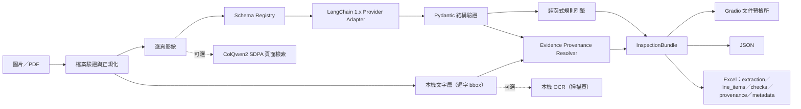
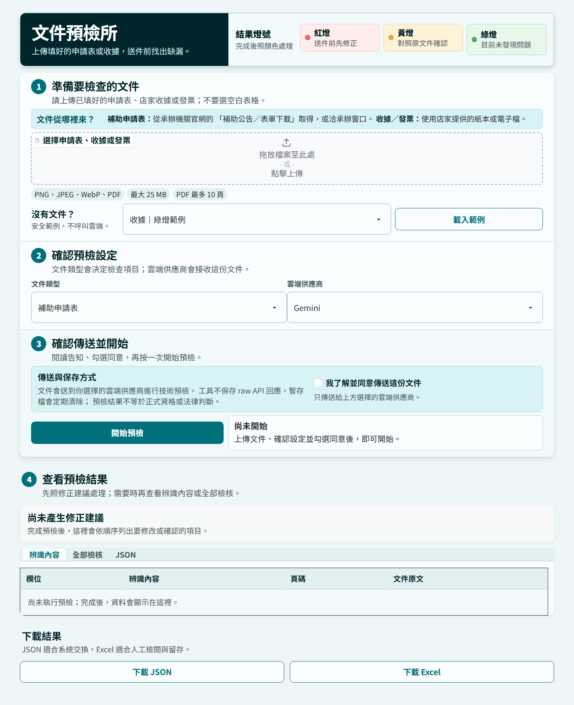
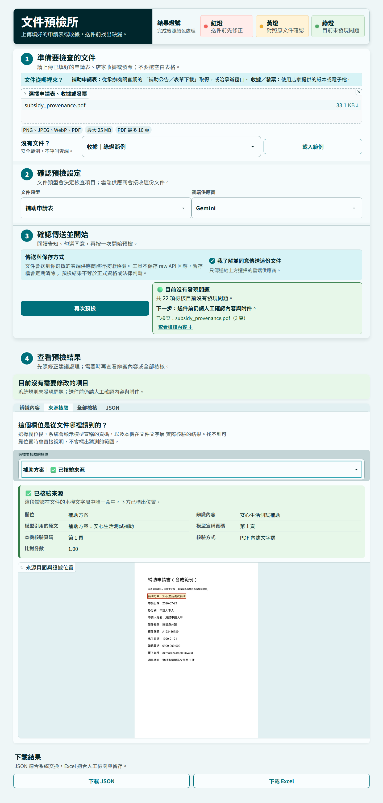

---
title: 文件預檢所
emoji: 📄
colorFrom: blue
colorTo: gray
sdk: docker
app_port: 7861
pinned: false
license: mit
---

# doc-inspector｜文件預檢所

[](https://github.com/kuotunyu/doc-inspector/actions/workflows/ci.yml)
[](https://www.python.org/)
[](LICENSE)
[](https://steven0226-doc-inspector.hf.space)

我常看到補助申請真正困難的地方，不一定是不符合資格，而是表單欄位、日期、身分資料、金額或附件稍有疏漏，就必須花時間往返補件。我想先把重複而可檢查的步驟交給工具，讓申請人在送件前看懂問題、提早修正，也藉這個專案實作一套面向台灣公共服務情境、透明、可測試且可重現的文件智慧流程。

> 目前版本：**v1.1.0**；各階段的本機工程與 Windows／Ubuntu CI 均已通過，[Public GitHub repository](https://github.com/kuotunyu/doc-inspector) 與 [Hugging Face 公開 live demo](https://steven0226-doc-inspector.hf.space) 可直接檢視。歷次版本見 [Releases](https://github.com/kuotunyu/doc-inspector/releases) 與 [CHANGELOG.md](CHANGELOG.md)。這是送件前預檢工具，不取代主管機關的正式資格審查。

**線上試用：[開啟文件預檢所](https://steven0226-doc-inspector.hf.space)**

## 專案導覽

- 想先看成果：開啟 [Live Demo](https://steven0226-doc-inspector.hf.space)，載入紅燈範例並查看修正清單。
- 想了解設計與取捨：閱讀 [Case Study](docs/CASE_STUDY.md)。
- 想知道「這個欄位到底從哪裡來」：閱讀 [來源核驗設計與評估](docs/EVIDENCE_PROVENANCE.md)。
- 想檢查品質證據：閱讀 [決策層產品評估](docs/DECISION_EVALUATION.md) 與 machine-readable [decision report](docs/assets/decision-evaluation.json)、[provenance report](docs/assets/provenance-evaluation.json)。
- 想在本機重現：依照下方快速開始與測試指令執行。
- 想參與改善：參考 [貢獻指南](.github/CONTRIBUTING.md)、[Security Policy](.github/SECURITY.md) 與 [CHANGELOG.md](CHANGELOG.md)。

## 可驗證成果

| 證據 | 目前結果 |
|---|---|
| 公開產品 | [Live Demo](https://steven0226-doc-inspector.hf.space) 可載入不含真實個資的紅／黃／綠合成案例 |
| 跨平台工程 | GitHub Actions 在 Windows／Ubuntu、Python 3.11 執行 locked install、coverage、部署、文件與發布包 gates；可用完整 commit SHA 唯讀驗證對應 CI |
| 本機 release gate | 254 passed，總 coverage 91% |
| 產品決策層 | 24 / 24 人工定義 regression cases exact match；不冒充 OCR／VLM 端到端準確率 |
| 欄位來源可核驗 | 61 個合成語料欄位：**false verified rate 0%**、可解析欄位 page accuracy 100%、verified bbox hit rate 100%；找不到可靠位置時明說不知道 |
| UI 品質 | 1920／1440／390 px 無水平溢出；互動目標至少 44 px；light／dark 系統偏好最低文字對比 6.89:1 |
| 發布包 | `1.1.0` wheel／sdist 通過 archive hygiene、作者 metadata 與全新環境離線安裝 smoke |

## 能做什麼

- 接受 PNG、JPEG、WebP 或最多 10 頁的 PDF。
- 以 `subsidy_application` 或 `receipt` 固定 schema 抽取欄位、頁碼與短證據。
- **在本機文字層核驗模型引用的原文**，在原始頁面上標出證據位置；無法確認時明確說不知道。
- 可切換兩個雲端供應商；模型 ID 全由 `.env` 設定。
- 以純函式規則檢查必填、日期、身分證格式與金額一致性，輸出紅／黃／綠結果。
- 下載不含本機絕對路徑與 raw API 回應的 JSON、五工作表 Excel。
- 提供固定種子、明顯浮水印且不含真實個資的合成 demo。
- 另有可選的 ColQwen2 本機視覺頁面檢索、可選的本機證據 OCR，以及不含 GPU 依賴的 CPU 容器。

## 架構



抽取路徑使用 `init_chat_model(...).with_structured_output(..., include_raw=True)`，不建立 Agent loop。PDF 由 PyMuPDF 以 200 DPI 轉圖；圖片會套用 EXIF 方向、轉成 RGB，長邊限制為 2400 px。模型不輸出座標；bounding box 一律由抽取完成後的確定性後處理，在文件自己的文字層中比對產生。

## 介面預覽

以下畫面由 Playwright 在本機擷取；介面採低彩度 refined civic desk，整頁只讓主要工作台形成單一浮起表面，並統一上傳、選單、告知、狀態、分頁與下載控制。桌面把標題與結果燈號合併為同一 masthead，文件來源與安全範例直接放在上傳區；1440px 工作台從 y=182 開始，390px 手機則從 y=366 開始。流程輔助文字與欄位標籤至少 18px，空結果表格會明確說明資料尚未產生。主要按鈕旁持續顯示等待、處理中、錯誤或完成狀態；雲端同意預設未勾選，因此驗證流程沒有送出 API 請求。瀏覽器 gate 也會分別模擬 light／dark 系統偏好，避免框架主題 token 讓淺色介面出現低對比文字。



## 模型選型與台灣生態系對照

| 任務 | 台灣模型／生態系候選 | v1.0 實際基準 | 決策 |
|---|---|---|---|
| 文件結構抽取 | `taide-gemma3-12b`（Ollama） | `GEMINI_MODEL` 主力、`OPENAI_MODEL` 第二供應商 | v1.0 先驗證跨供應商 schema；模組可切換，地端生成留待同一評估集比較 |
| 文字 embedding | `taide/embeddinggemma-GTAIDE-300m-2605` | `BAAI/bge-m3` 可作基準 | v1.0 沒有文字 RAG；日後加入時必須分別使用 query／document `prompt_name` |
| Reranker | 尚無已驗證的本土 reranker | `BAAI/bge-reranker-v2-m3` | v1.0 未啟用；保留為未來 RAG 對照 |
| 視覺頁面檢索 | 尚無已驗證的台灣 ColVision 等價模型 | `vidore/colqwen2-v1.0-hf` | Transformers 原生版、BF16、SDPA；英文訓練模型在中文 XFUND 做零樣本評估 |

雲端預設為 `gemini-3.5-flash-lite` 與 `gpt-5-mini`，但程式碼不寫死供應商模型 ID。模型現行能力於 2026-07-23 依官方文件確認；正式執行仍以 `.env` 為準。

## 快速開始（Windows 11／PowerShell）

需求：Python 3.11、[uv](https://docs.astral.sh/uv/)、Tesseract 5；OCR benchmark 需要 `chi_sim` 與 `eng`。

```powershell
uv sync
Copy-Item .env.example .env
```

填入 `.env`：

```dotenv
GOOGLE_API_KEY=
OPENAI_API_KEY=
GEMINI_MODEL=gemini-3.5-flash-lite
OPENAI_MODEL=gpt-5-mini
COLQWEN_MODEL=vidore/colqwen2-v1.0-hf
MODEL_MAX_TOKENS=4096
GRADIO_SERVER_NAME=127.0.0.1
GRADIO_SERVER_PORT=7861
```

啟動本機介面：

```powershell
uv run python app.py
```

開啟 `http://127.0.0.1:7861`。7860 保留給其他專案；程式不會自動終止占用連接埠的其他程序。若 7861 已被使用，請在 `.env` 改用其他連接埠。

### 合成 demo

若手上沒有文件，可直接在介面選擇「範例文件」並按「載入範例」；程式會在本機產生安全的合成文件、放入上傳區，並自動設定文件類型，不會在載入時呼叫雲端模型。

操作順序是「準備文件 → 確認設定 → 同意並開始 → 查看結果」。按下「開始預檢」一次即可；處理期間按鈕會暫時停用，完成後可依紅、黃、綠燈查看明細並下載 JSON 或 Excel。

若要一次產生全部測試產物：

```powershell
uv run python scripts/generate_demo_documents.py
```

會產生綠、黃、紅三種補助案例與一張綠燈收據；每張圖都有「合成測試資料／非真實文件」浮水印、固定種子 `20260723`、預期 extraction、JSON 與 Excel。

### 本機視覺檢索

GPU extra 不會隨一般 UI 安裝：

```powershell
uv sync --extra local-retrieval
uv run --extra local-retrieval python scripts/run_retrieval_demo.py
```

Windows 使用官方 CUDA 12.8 wheel 與 SDPA，不使用 `flash-attn`、vLLM 或 faiss。

## 測試與建置

```powershell
uv sync --all-extras --all-groups
uv lock --check
uv run python scripts/verify_deployment.py
uv run --all-extras pytest --cov=doc_inspector --cov-report=term --cov-fail-under=85
uv run python -m compileall -q src scripts tests
uv run python scripts/run_product_evaluation.py --check
uv run python scripts/run_provenance_evaluation.py --check
uv run python scripts/verify_public_docs.py
uv build --clear --no-build-isolation
uv run python scripts/verify_distribution.py
uv run python scripts/verify_release.py
```

2026-07-30 v1.1.0 本機 release gate：**254 passed，總 coverage 91%**；wheel 與 sdist 均成功建立，發布包檢查確認只含 `1.1.0` 產物，且 wheel 可在全新 virtual environment 由 uv cache 離線安裝完整相依並載入。UI gate 另在瀏覽器 light／dark 系統偏好下抽查關鍵文字對比，最低為 **6.89:1**，並在 1440／390 px 逐一驗證五種來源核驗狀態。預設單元測試不需網路、API key、Tesseract、GPU 或啟動對外 UI；付費 API、benchmark、GPU 與瀏覽器驗證由明確腳本分開執行。

公開 repository 的 `CI` 會在 `windows-latest` 與 `ubuntu-latest` 使用 Python 3.11、locked base／dev dependencies（包含 build backend），執行核心離線測試、85% coverage 下限、決策層產品評估、compileall、wheel／sdist build、archive hygiene、隔離 wheel 安裝 smoke 與 secret-safe release verifier。CI 不安裝可選 GPU extra；`tests/test_retrieval.py` 會明確標示 skip，也不注入或呼叫任何模型 API key。本機以 `--all-extras` 執行時仍會完整驗證檢索計分。

維護者推送後可用 `scripts/check_github_ci.py --expected-sha <完整 SHA>` 確認綠燈確實屬於該 commit，再用 `scripts/check_github_contributors.py` 確認作者歸屬；同步 Space 後，`scripts/check_space_snapshot.py --github-sha <完整 SHA>` 會逐位元比對固定的 runtime 關鍵檔。三者都只讀取公開 HTTPS 資源、不使用 token，也不放入預設離線 CI。

## 決策層產品評估

24 個人工定義的 regression cases 以固定 synthetic extraction 為輸入，涵蓋兩個 schema、三種燈號與 13 個非綠燈 rule ID。每個案例都明確列出欄位 mutation、預期整體燈號與 `rule_id + level + field_paths`，不是由目前規則輸出自動產生。

| 指標 | 結果 |
|---|---:|
| Exact case match | 24 / 24 |
| 整體燈號 accuracy | 100% |
| Issue precision／recall | 100%／100% |
| 紅燈／黃燈 issue recall | 100%／100% |

這些數字只證明固定輸入下的**決策層 contract**，不代表 OCR、VLM 或真實文件端到端準確率。評估方法、案例分布與 error analysis 見 [決策層產品評估](docs/DECISION_EVALUATION.md)。

## 來源核驗

模型回傳的 `page_number` 與 `evidence_text` **也是模型生成的**，本身無法證明那段文字真的在文件裡。v1.1 因此把「模型宣稱」與「已驗證來源」拆開：抽取完成後，系統用確定性後處理在文件自己的文字層中比對模型引用的原文，找到唯一一處才標位置。



五種狀態各自有不同且不誤導的說明：

| 狀態 | 意義 | 會不會給位置 |
|---|---|---|
| `verified` | 證據在文字層中唯一精確命中，頁碼也相符 | 會 |
| `approximate` | 找到唯一位置但有保留（部分相符、頁碼不符） | 會 |
| `ambiguous` | 文件中有多處一模一樣的內容 | 不會 |
| `page_only` | 該頁沒有文字層，頁碼來自模型且未經驗證 | 不會 |
| `unresolved` | 本機找不到這段證據 | 不會 |

固定合成語料共 4 份 PDF、61 個欄位（51 個有 ground-truth 頁碼與 bbox），涵蓋重複值、錯誤頁碼、幻覺證據、換行接合、旋轉頁、算繪後縮放、巢狀清單與純影像頁。Ground truth 由文件生成器的版面規格直接記錄，不從系統輸出反推。

| 指標 | 結果 | 事前 gate |
|---|---:|---|
| False verified rate | **0.00%** | = 0% ✅ |
| 可解析欄位 page accuracy | **100.00%** | ≥ 95% ✅ |
| Verified bbox hit rate（IoU ≥ 0.5） | **100.00%** | ≥ 90% ✅ |
| 所有有宣稱欄位的 bbox 覆蓋率 | 85.00% | — |
| 定位延遲 p50／p95 | 0.036／0.102 ms | — |

85% 是刻意的取捨：其餘 15% 的欄位系統選擇說「不知道」，而不是給一個猜測的框。設計、威脅模型、比對政策、完整 error analysis 與已知限制見 [來源核驗設計與評估](docs/EVIDENCE_PROVENANCE.md)；機器可讀結果見 [provenance-evaluation.json](docs/assets/provenance-evaluation.json)。

```powershell
uv run python scripts/run_provenance_evaluation.py
```

掃描件沒有文字層時預設維持 `page_only`。若需要，可安裝可選的本機 OCR（另需系統 Tesseract 5）：

```powershell
uv sync --extra local-ocr
```

並在 `.env` 設定 `EVIDENCE_OCR=true`。未安裝時不會報錯，也不會中斷預檢。

## XFUND 評估

資料：XFUND v1.0 中文，固定 seed `20260723`；50 份官方 val 加 50 份未調 prompt 的 train holdout，共 100 份、3,343 組 question-answer ground truth。split manifest SHA-256：`08758d3733e348ee0d3441e0aa2bcd32b790def0280356bcaf0667d8da085b97`。

正規化只做 NFKC、ASCII Latin lowercase、trim 與空白壓縮。以下是重複感知的嚴格 key-value exact match：

| 方法 | 文件 | 預測 pairs | 命中 | Micro precision | Exact-match recall | Micro F1 | Macro document F1 |
|---|---:|---:|---:|---:|---:|---:|---:|
| Tesseract `chi_sim+eng` + 簡單 regex | 100 | 347 | 0 | 0.0000 | 0.0000 | 0.0000 | 0.0000 |
| `GEMINI_MODEL` | 100 | 2,150 | 1,228 | 0.5712 | 0.3673 | 0.4471 | 0.4584 |
| `OPENAI_MODEL` | 100 | 2,027 | 1,294 | 0.6384 | 0.3871 | 0.4819 | 0.4959 |

Tesseract 的 0 分代表「簡單 OCR 行切割 + 嚴格 key-value exact match」沒有命中，不等同於 OCR 完全讀不到字；這個低基準刻意保持透明，沒有用評估答案調 regex。

重現流程：

```powershell
uv run python scripts/download_xfund.py
uv run python scripts/prepare_xfund_benchmark.py
uv run python scripts/run_tesseract_baseline.py
uv run python scripts/run_xfund_cloud_benchmark.py `
  --confirm-paid-api `
  --approved-max-cost-usd 15 `
  --approved-gemini-model gemini-3.5-flash-lite `
  --approved-openai-model gpt-5-mini
```

付費 benchmark 有模型 ID 漂移檢查、三份校準、逐文件 checkpoint、失敗預留與硬成本上限；預設命令不會誤觸批次付費 API。

## ColQwen2 視覺檢索結果

固定使用 XFUND val 的 50 頁與前 20 個文件產生的中文欄位查詢；模型 revision `0d3e414967fde994dd99a0ccc29bcb34b5355712`。

| 指標 | 結果 |
|---|---:|
| Recall@1 | 0.95 |
| Recall@3 | 1.00 |
| 模型載入 | 5.84 秒 |
| 索引速度 | 0.277 秒／頁 |
| 查詢 embedding | 2.09 ms／筆 |
| 逐文件 MaxSim | 7.56 ms／查詢 |
| 峰值 VRAM | 4.28 GiB |

環境為 RTX 4090、Torch 2.11.0+cu128、Transformers 5.14.1、BF16、SDPA。計分逐文件執行 MaxSim，避免建立完整 `Q × D × Lq × Ld` 張量。

## 成本

2026-07-23 官方標準價下的實跑 smoke：

| 請求 | Input／output tokens | 實測估算 |
|---|---:|---:|
| Gemini 二頁補助申請 | 2,341／798 | US$0.002697 |
| OpenAI 單頁收據 | 1,543／1,982 | US$0.004350 |

100 文件 × 2 provider benchmark 的計量成本約 US$0.7521。加上 smoke、校準、
保守失敗預留及發布前合成 UI smoke 的 US$0.02 保守預留後，專案記錄的總
charged-or-reserved 為 **US$0.87104350**，低於核准硬上限 US$15。實際費用仍以供應商帳單為準。

## 隱私與安全邊界

- `.env`、原始文件、benchmark、模型權重、輸出與 log 均由 ignore 規則排除。
- UI 必須先勾選「文件會傳送給雲端供應商」才會執行。
- 不保存 raw API 回應；錯誤摘要只包含錯誤型別與欄位路徑。
- 匯出資料沒有來源絕對路徑；Excel 關閉公式與 URL 自動解析，避免公式注入。
- 來源核驗只匯出 field path、短證據、頁碼、狀態、bbox 與說明；不輸出整頁文字或
  OCR dump。頁面預覽只寫進 Gradio 受管快取，不進入任何匯出檔；provenance 檢視
  資料放在 server-side session state，不送到瀏覽器。
- 上傳與匯出檔共用 Gradio 管理的 cache，每 10 分鐘清理，伺服器關閉時再清空；
  不開放任意 `allowed_paths`。
- Gradio analytics、monitoring 與事件 API 均停用或設為 private；等待佇列最多
  8 件，上傳階段即限制 25 MB。本機預設只綁 `127.0.0.1`。
- 公開容器預設每小時最多接受 60 次模型預檢；這是單一程序共用的安全網，
  重啟後會重置，不能取代供應商端的硬性支出上限。
- 這不是正式資格判斷；紅燈代表明確不一致，黃燈代表需補資料或人工複核，綠燈只代表目前規則未發現問題。

## Demo 資料與授權

- XFUND v1.0：CC BY-NC-SA 4.0；原始資料、圖片與逐筆模型輸出不提交，請用下載腳本重建。
- `scripts/download_demo_forms.py` 可下載三份政府公開表單並記錄 URL、SHA-256、頁數與來源頁面。因各站再散布條款不一致，PDF 僅供本機測試，不納入 repo 或公開 demo。
- 公開 demo 應只使用 `scripts/generate_demo_documents.py` 產生的合成文件。
- 程式碼採 MIT License；資料與模型各自依來源授權。

## CPU 容器與部署

```powershell
docker build -t doc-inspector:local .
docker run --rm -p 7861:7861 `
  -e GOOGLE_API_KEY `
  -e GEMINI_MODEL `
  -e OPENAI_API_KEY `
  -e OPENAI_MODEL `
  doc-inspector:local
```

本機驗證的映像約 357MB、health=healthy、以 UID 10001 執行，且不含 Torch／Transformers／Accelerate。正式上線必須由維護者用平台 Secrets 注入金鑰；不要把 `.env` 複製進映像。容器原理、本機驗證、完整發布、私人驗收與復原順序都集中在 [遠端發布指南](docs/REMOTE_SETUP.md)。

遠端名稱固定為 GitHub `kuotunyu/doc-inspector` 與 Hugging Face
`steven0226/doc-inspector`；以 GitHub 為主倉、Hugging Face Docker Space
為部署鏡像。逐步人工操作見
[GitHub 與 Hugging Face 同名發布](docs/REMOTE_SETUP.md)。

## 目前限制

- 只有補助申請與收據兩個固定 schema。
- 規則集是技術預檢，不包含各機關完整資格法規。
- 來源核驗只能驗證有原生文字層的頁面；掃描件在預設安裝下永遠是 `page_only`。
  合成語料的 IoU 接近 1.0 反映的是語料性質，不等於真實版面的定位精度。
- 雲端模型可能誤讀手寫、低解析、旋轉或極密集表格，仍需人工核對 evidence。
- XFUND 指標是嚴格 exact match，不能直接等同真實案件可用率。
- 視覺檢索模型主要以英文訓練；目前中文結果是單一固定資料集的零樣本證據。
- 公開 live demo 使用維護者設定的雲端 API 配額；程序內共用每小時 60 次上限只能降低一般濫用，不能取代供應商端硬性支出上限。

## 參與與安全

歡迎以 Issue 或 Pull Request 提出可重現的改善。請先閱讀 [貢獻指南](.github/CONTRIBUTING.md)；安全問題請依 [Security Policy](.github/SECURITY.md) 使用 Private vulnerability reporting，不要在公開 Issue 放入 API key、真實個資、完整文件或 raw provider response。
