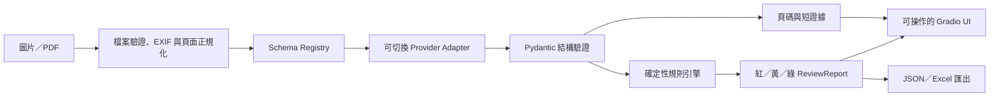

# Case Study｜把文件預檢做成可解釋的產品

## 摘要

`doc-inspector` 是一個以正體中文為主的送件前文件預檢工具。使用者上傳補助申請表或收據後，系統先抽取結構化欄位與來源證據，再用確定性規則檢查必填、日期、身分證件與金額一致性，最後以紅／黃／綠燈和具體修正建議呈現。

這個專案的重點不只是「讓模型看文件」，而是把不穩定的模型輸出包在可驗證的產品邊界內：

- 固定 Pydantic schema，拒絕額外或結構錯誤的欄位。
- 模型只負責抽取；重要判斷由純函式規則完成。
- 每個欄位保留來源頁碼與短證據，讓使用者可以回看原文。
- 雲端 provider 可切換，模型 ID、token 上限與 API key 均由環境設定。
- 全流程有離線測試、固定產品案例、跨平台 CI、公開 demo 與可重建容器。

## 問題與使用者

許多文件被退回不是因為申請人必然不符合資格，而是欄位遺漏、日期格式錯誤、金額加總不一致或證件資料有誤。這些問題適合在送件前先被機器發現，但使用者真正需要的不是一份 JSON，而是：

1. 我現在能不能送？
2. 哪幾項一定要先改？
3. 哪幾項只是需要人工確認？
4. 系統是從文件哪裡得到這個答案？

因此產品把輸出分成：

- **紅燈**：送件前先修正。
- **黃燈**：對照原文件人工確認。
- **綠燈**：目前規則未發現問題。

這些燈號只代表技術預檢，不是資格、法律或行政處分判斷。

## 約束

| 約束 | 設計回應 |
|---|---|
| 文件可能含個資 | 暫存處理、不記錄原文、不輸出 raw API response、匯出檔不含本機路徑 |
| 模型可能幻覺或漏欄 | 固定 schema、嚴格驗證、欄位頁碼與短證據、規則層不讓模型自由判斷 |
| 使用者不懂技術欄位 | 結果先顯示下一步；完整辨識內容與 JSON 放到次要分頁 |
| Windows 是主要開發環境 | Python 3.11、uv、`pathlib.Path`、Windows／Ubuntu CI |
| 公開 demo 會消耗 API 配額 | 明示傳送範圍、使用者主動勾選、程序內 rate limit、供應商後台硬上限 |
| GPU 功能不應拖累基本部署 | 視覺頁面檢索放在 optional extra；公開容器只裝 CPU 核心依賴 |

## 解法與架構

### 關鍵分層

1. **Ingest**：驗證副檔名、檔案大小、PDF 頁數，轉成適合模型處理的 RGB 頁面。
2. **Schema**：兩個 v1 preset—`subsidy_application`、`receipt`—都使用嚴格 Pydantic model。
3. **Provider**：以 LangChain 1.x structured output 封裝不同雲端模型，統一錯誤與 token usage。
4. **Rules**：必填、日期、台灣身分證檢查碼與金額關係都由純函式執行。
5. **Service**：負責暫存生命週期、成本與安全輸出，不讓 UI 直接碰 provider 細節。
6. **Presentation**：先回答「下一步做什麼」，再提供辨識內容、完整檢核和 JSON。

## 重要工程決策

### 1. 把「辨識」與「判斷」分開

如果讓模型同時抽取欄位並判斷是否合格，結果很難重現，也很難知道錯在辨識還是規則。專案讓模型只產生結構化 extraction，再把判斷交給具名、可單獨測試的規則。這讓錯誤分析可以落到 `date.parse`、`identity.citizen_id` 或 `amount.receipt_total` 等具體 contract。

### 2. 用證據而不是信心分數

模型信心分數跨供應商不一定可比。專案改為保留 `page_number` 與 `evidence_text`，讓使用者能回到原文件核對。證據短、可匯出，也不等於保存完整 API 回應。

### 3. 讓黃燈代表「不能安全自動判斷」

例如護照不應套用台灣身分證檢查碼，缺少出生日期也不能猜測日期先後。系統使用黃燈保留人工判斷，而不是為了提高自動化率硬判紅或綠。

### 4. 以安全 synthetic demo 降低試用門檻

公開 demo 內建固定種子產生的綠／黃／紅補助案例與綠燈收據，全部有明顯標示且不含真實個資。使用者可以先走完整流程，再決定是否上傳自己的文件。

## 遇到的問題與修正

### 容器內沒有中文字型

本機 Windows demo 正常，但 Debian slim 容器載入範例時無法產生中文文件。修正方式不是把字型檔提交到 repository，而是在 Docker image 安裝 `fonts-noto-cjk`，並讓字型搜尋同時支援 Windows Fonts 與 Linux Noto 路徑。這個部署落差也加入測試，避免回歸。

### 原始結果對一般使用者太技術化

最初介面直接展示欄位 path 與大表格，使用者不知道下一步。後續把主要流程改成：

1. 準備文件。
2. 確認設定與傳送範圍。
3. 開始預檢。
4. 依修正清單處理後下載。

完整欄位與 JSON 仍保留，但退到第二層資訊。

### 公開部署與主 repository 不同源

GitHub 是主倉，Hugging Face Space 是部署鏡像。為避免誤傳 `.env`、本機 cache 或未追蹤檔案，每次部署都從同一個 Git commit 建立乾淨 archive，再上傳 Space。

## 評估與驗證

### 決策層產品回歸

固定案例不是從目前規則輸出自動產生，而是人工列出輸入 mutation 與預期 issue signature。24 個案例涵蓋兩個 schema、三種燈號與 13 個非綠燈 rule ID。

| 指標 | 結果 |
|---|---:|
| Exact case match | 24 / 24 |
| 整體燈號 accuracy | 100% |
| Issue precision／recall | 100%／100% |
| 紅燈 issue recall | 100% |
| 黃燈 issue recall | 100% |

這是**決策層 regression benchmark**，證明固定輸入下的規則與產品 contract；它不代表 OCR、VLM 或真實世界端到端準確率。方法與 error analysis 見 [DECISION_EVALUATION.md](DECISION_EVALUATION.md)。

### 端到端抽取基準

專案另以固定 split 的 XFUND 中文資料比較兩個雲端 provider 與 OCR + regex baseline。嚴格 key-value exact match 下，兩個雲端模型 Micro F1 分別為 0.4471、0.4819；結果顯示模型抽取仍是主要誤差來源，也說明為什麼規則層與人工核對不能省略。

### 工程 gate

- Windows／Ubuntu、Python 3.11 的無 secrets CI。
- `uv.lock` 漂移檢查。
- pytest coverage gate ≥ 85%。
- Python compileall、鎖定 build backend 的 wheel／sdist build、archive hygiene、全新 virtual environment 離線安裝完整相依的 wheel smoke 與 release verifier。
- Playwright 多尺寸 UI audit 與無水平溢出檢查。

## 我在這個專案負責的範圍

- 從問題定義、資料 contract、provider abstraction 到規則層與 Gradio UI 的整體設計。
- 建立可重現 benchmark、成本記錄與錯誤分析，不只展示成功案例。
- 處理 Windows／Linux、GPU optional extra、Docker 與公開 Space 的部署差異。
- 設計隱私邊界、rate limit、secret-safe 匯出與公開 release gate。
- 透過多輪使用者驗收調整資訊架構，而不是只做視覺美化。

## 已知限制

- 目前只有補助申請表與收據兩個固定 schema。
- XFUND 指標顯示真實版面與欄位抽取仍有明顯改善空間。
- 公開 Space 的程序內 rate limit 不是跨重啟、per-user 的完整濫用防護。
- 沒有帳號、人工審核佇列、長期文件儲存或多租戶權限。
- 公開 demo 依賴外部模型供應商，服務可用性與成本仍受供應商影響。

## 下一步

1. 建立匿名真實版面 error taxonomy，分離 OCR、欄位對齊、型別與規則錯誤。
2. 在相同評估集比較地端模型與雲端基準。
3. 增加人工確認回饋，但只保存使用者明確同意的去識別結果。
4. 依公開使用情況再評估持久化 rate limit 與排程佇列。
