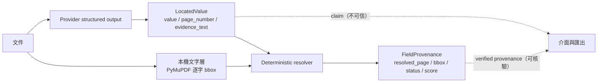

# 來源核驗（Verified Evidence Provenance）

v1.0 已經會回傳每個欄位的 `page_number` 與 `evidence_text`。問題是：那兩個值**也是模型生成的**。使用者看到「第 2 頁」時，沒有任何東西能證明那段文字真的在第 2 頁，甚至真的在這份文件裡。

v1.1 把「模型宣稱」和「本機驗證過的來源」拆成兩層。抽取完成後，系統會用確定性的後處理，在文件自己的文字層裡找出模型引用的那段原文；找到唯一一處就標出位置，找不到或找到很多處就明說不知道。**系統在任何情況下都不會生成一個沒有根據的 bounding box。**

## 威脅模型

| 威脅 | 具體情境 | v1.1 的處理 |
|---|---|---|
| 幻覺證據 | 模型引用一段文件裡根本沒有的文字 | 全文件比對失敗 → `unresolved`，不給位置 |
| 幻覺頁碼 | 內容存在，但模型說錯頁 | 定位到真正的頁 → `approximate` 並記錄 mismatch warning |
| 幻覺座標 | 若讓模型自己輸出 bbox，它會編一個看起來合理的框 | 模型**不被允許**輸出 bbox；座標只能來自本機文字層或本機 OCR |
| 重複內容誤導 | 同一段文字在文件中出現多次，隨便挑一處會指錯地方 | 只要在整份文件出現超過一次就回報 `ambiguous`，不給位置 |
| 掃描件無法驗證 | 圖片或掃描 PDF 沒有文字層 | `page_only`，介面明說「頁碼來自模型，位置未經本機驗證」 |
| 假的成功訊號 | 介面把無法驗證的欄位顯示成綠燈 | 五種狀態有各自的文字、色塊與說明；`unresolved` 顯示紅色 |
| 誤把證據當隱私外洩 | 匯出檔挾帶整頁 OCR、原始路徑或 raw response | 匯出只含 field path、短證據、頁碼、狀態、bbox 與 warning |

核心不變式：**`verification_status == "verified"` 只能由本機文字層或本機 OCR 產生，且該證據在整份文件中唯一命中。**

## 「模型宣稱」與「已驗證來源」的差別



`LocatedValue` 完全沒有改動，provider 的 structured-output schema 也沒有改動。provenance 是**抽取完成之後**才由純函式後處理產生的，模型看不到、也影響不了它。

## 資料契約

版本：`provenance_version = "1.0.0"`，掛在 `InspectionBundle.provenance`，欄位可為 `null`，因此 v1.0.0 的 JSON 仍能解析。

### `NormalizedBBox`

```json
{ "x0": 108.4, "y0": 180.2, "x1": 413.1, "y1": 202.6 }
```

- 座標空間 `normalized_1000_top_left`：原點在**算繪後頁面**的左上角，兩軸皆為 `0`–`1000`。
- 驗證條件 `x0 < x1` 且 `y0 < y1`；退化或反向矩形會被 Pydantic 拒絕。
- 與 render DPI、PDF crop box、頁面旋轉、後續縮圖全部無關，因此同一份 JSON 可以套在任何尺寸的頁面預覽上。

### `FieldProvenance`

| 欄位 | 意義 |
|---|---|
| `field_path` | 穩定的 dotted path，例如 `applicants.0.name`、`line_items.2.amount` |
| `claimed_page_number` | 模型宣稱的頁碼（原封不動保留） |
| `resolved_page_number` | 本機實際定位到的頁碼；無法確認時為 `null` |
| `evidence_text` | 模型引用的原文（原封不動保留） |
| `bbox` | 只有 `verified` 與 `approximate` 會有值 |
| `resolution_method` | `native_pdf_text` / `optional_local_ocr` / `model_claim_only` / `unavailable` |
| `verification_status` | `verified` / `approximate` / `ambiguous` / `page_only` / `unresolved` |
| `match_score` | 命中字元數 ÷ 正規化後證據長度，`0`–`1` |
| `candidate_count` | 找到的相異候選區域數 |
| `warning` | 正體中文說明，直接顯示給使用者 |

模型層級的不變式由 Pydantic validator 強制執行，而不是靠呼叫端自律：

- `ambiguous` / `page_only` / `unresolved` **不得**帶 bbox。
- `verified` / `approximate` **必須**同時有 bbox 與 `resolved_page_number`。
- `resolution_method == "model_claim_only"` **不得**帶 bbox。
- `verified` **只能**來自 `native_pdf_text` 或 `optional_local_ocr`。

### 狀態語意

| 狀態 | 意義 | 有 bbox？ |
|---|---|---|
| `verified` | 證據在文件文字層中唯一精確命中，且頁碼與模型宣稱一致 | 是 |
| `approximate` | 找到唯一位置，但有保留：部分相符、頁碼不符，或改以欄位值定位 | 是 |
| `ambiguous` | 文件中有 2 處以上一模一樣的內容，不猜是哪一處 | 否 |
| `page_only` | 該頁沒有可用文字層；頁碼來自模型且未經驗證 | 否 |
| `unresolved` | 本機找不到這段證據，或模型沒有提供可核驗的內容 | 否 |

### `field_path` 慣例

使用 `applicants.0.name` 這種 dot-index 形式，而不是 `applicants[0].name`。理由是既有的 `RuleResult.field_paths` 與 Excel `extraction` 工作表已經用同一套慣例，維持一致才能把「某條規則亮紅燈」和「那個欄位的來源在哪」直接 join 起來，不需要翻譯。路徑順序來自 Pydantic 欄位宣告順序與 list index，因此不會因為介面排序而改變。

## 座標慣例

PyMuPDF 有兩個容易踩到的行為，這裡明確記錄：

1. **`page.get_text(...)` 回傳的是未旋轉座標。** 一頁 `/Rotate 90` 的 PDF，文字座標仍在原始 mediabox 空間。必須乘上 `page.rotation_matrix` 才會落在使用者看到的位置。
2. **`page.rect` 已經包含 crop box 與旋轉。** 文字座標也已相對於 crop box 原點，所以正規化直接用 `page.rect` 即可。

```
rendered_rect = raw_rect * page.rotation_matrix
x_norm = (rendered_rect.x - page.rect.x0) / page.rect.width  * 1000
y_norm = (rendered_rect.y - page.rect.y0) / page.rect.height * 1000
```

`page.get_pixmap(dpi=D)` 算繪的正是 `page.rect`，之後的 `thumbnail()` 又是等比例縮放，所以同一組正規化座標對 72 dpi、200 dpi 或縮到 900 px 的預覽都成立。這一點由 `tests/test_provenance_ingest.py` 以「把預測框套回實際算繪影像、數框內墨點比例」的方式驗證，涵蓋 0/90/180/270 度、crop box 與大頁縮放。

### 為什麼用逐字而不是逐詞

`get_text("words")` 不會在**全形空白**處斷詞，所以一整行中文可能變成單一個「word」，highlight 會把不相干的內容一起框起來。因此文字層改用 `get_text("rawdict")` 的逐字 bbox；中文沒有詞間空白，這是唯一能讓 highlight 貼合證據的作法。

## 比對政策

### 正規化（只做這三件事）

1. Unicode NFKC。
2. Case folding。
3. 移除空白與零寬字元（`U+00AD`、`U+200B`–`U+200D`、`U+2060`、`U+FEFF`）。

移除空白就是換行、多餘空格、全形空白能被吸收的原因。**連字號刻意保留**：`DEMO-PASSPORT-001` 與 `DEMOPASSPORT001` 是不同的識別碼，把連字號吃掉會讓不同的證件號碼互相誤命中。千分位逗號同理保留。

### 搜尋順序

1. **精確比對**：把每頁的字元串起來（每個字元記住來源 glyph），在整份文件搜尋正規化後的證據字串，收集所有相異命中區域。
2. **保守的部分比對**（只有精確比對完全落空才啟動）：以二分搜尋找出「證據的最長子字串且該子字串出現在某頁」的長度 `k`。接受條件是 `k ≥ max(4, ceil(0.6 × 證據長度))`，且證據正規化後至少 6 字元。`match_score = k / 證據長度`。
3. 若證據不存在但 `value` 存在，改以 `value` 定位，狀態上限為 `approximate`，warning 明說是用欄位值找的。

### 判定規則

```
候選數 > 1 → ambiguous（不給 bbox）
              候選全在同一頁 → 記錄該頁；跨頁 → resolved_page = null
候選數 = 1 → verified，除非以下任一成立則降為 approximate：
              · 只是部分相符
              · 模型宣稱的頁碼 ≠ 實際找到的頁碼
              · 是用 value 而非 evidence_text 定位
              · 來自 OCR 且任一命中詞信心 < 80
候選數 = 0 → 宣稱頁碼超出頁數      → unresolved
              宣稱頁碼那一頁沒有文字層 → page_only
              全文件都沒有文字層      → page_only（有頁碼）／unresolved（無頁碼）
              其他                    → unresolved
```

**重複即模糊，即使其中一處落在模型宣稱的頁上。** 這是刻意選擇精確度而犧牲覆蓋率：如果同時發生「頁碼宣稱錯誤」與「該值跨頁重複」，用宣稱頁去消歧義就會產生一個**看起來已驗證但其實指錯地方**的框。禁止這種情況，比多蓋幾個框重要。

## 退化政策

- 圖片、掃描 PDF 或任何沒有文字層的頁 → `page_only`，介面明示位置未經驗證。
- 基礎安裝**不含**任何 OCR、GPU 或系統相依；Docker CPU 映像與 CI 也沒有。
- 可選 `local-ocr` extra（`pytesseract` + 系統 Tesseract 5）只會用在**沒有原生文字層**的頁面上。未安裝、二進位不存在、或 OCR 執行失敗時，該頁安靜退回 `page_only`，整份預檢不中斷。
- OCR 命中最高只能標成 `verified`，且必須同時滿足：精確比對、全文件唯一、頁碼相符、所有命中詞信心 ≥ 80。任一條件不成立就是 `approximate`。
- 啟用方式為 `.env` 的 `EVIDENCE_OCR=true`，預設關閉。

## 評估協定

### 語料

`data/evaluation/provenance/`，由 `scripts/build_provenance_corpus.py` 產生，固定 seed `20260730`。

| 文件 | 頁 | 內容 |
|---|---:|---|
| `doc_a_subsidy_four_pages` | 4 | 標準四頁補助申請表 |
| `doc_b_subsidy_rotated_and_oversized` | 3 | 第 2 頁旋轉 90°、第 3 頁 1224×1584 pt（會觸發算繪後縮放）、含換行接合 |
| `doc_c_receipt_failure_cases` | 2 | 重複值、錯誤頁碼、部分文字、空白雜訊、幻覺證據 |
| `doc_d_receipt_scanned_image_only` | 1 | 整頁只有影像、沒有文字層 |

共 **61 個欄位**，其中 **51 個有 ground-truth 頁碼與 bbox**。每份 PDF 的 SHA-256 記在 manifest，評估時逐一驗證。文件不含任何真實個資。

**Ground truth 由生成器直接記錄。** 生成器知道每一行的文字、插入點、字級與頁面旋轉，bbox 是用 `pymupdf.Font.text_length` 與 ascender／descender 從版面規格算出來的，再套用同一組旋轉／正規化轉換。整個生成流程**不讀取 PyMuPDF 的文字抽取結果，也不讀取 resolver 的輸出**，所以標註無法被反推或調成好看的樣子。`scripts/run_provenance_evaluation.py` 只讀 manifest、不寫 manifest；`tests/test_provenance_eval.py` 會實際比對執行前後的 manifest bytes。

### 涵蓋的失敗案例

`duplicate_same_page`、`duplicate_across_pages`、`wrong_claimed_page`、`hallucinated_evidence`、`partial_evidence`、`whitespace_noise`、`rotated_page`、`render_resize`、`nested_list`、`additional field`、`null_value`、`image_only_page`、`claimed_page_out_of_range`、`line_wrap_join`、`fuzzy_partial_match`、`separator_drift`、`paraphrased_evidence`、`cross_page_evidence`。

### 指標定義

- **page localization accuracy**：在「可解析欄位」（ground truth 認為應該定位得到的 51 個）中，`resolved_page_number` 正確的比例。
- **bbox localization coverage**：可解析欄位中拿到 bbox 的比例。
- **overall bbox coverage**：**所有有宣稱的欄位**中拿到 bbox 的比例——這才是使用者實際感受到的覆蓋率。
- **bbox hit rate**：所有預測 bbox 中，頁碼正確且 `IoU ≥ 0.5` 的比例。
- **verified bbox hit rate**：被標為 `verified` 的欄位中命中的比例。
- **false verified rate**：被標為 `verified` 卻沒有命中（含沒有 ground truth 位置、頁碼錯誤、IoU < 0.5）的比例。
- **ambiguous detection rate**：應為 `ambiguous` 的欄位確實被標成 `ambiguous` 的比例。
- **localization latency**：單一欄位在已建好索引上的解析耗時。

## 實測結果

2026-07-30 於 Windows 11、Python 3.11.15、PyMuPDF 1.28.0（MuPDF 1.29.0）執行；機器可讀報告見 [`docs/assets/provenance-evaluation.json`](assets/provenance-evaluation.json)。

| 指標 | 結果 | 事前 gate |
|---|---:|---|
| False verified rate | **0.00%**（0 / 48） | = 0% ✅ |
| 可解析欄位 page accuracy | **100.00%**（51 / 51） | ≥ 95% ✅ |
| Verified bbox hit rate（IoU ≥ 0.5） | **100.00%**（48 / 48） | ≥ 90% ✅ |
| 狀態完全相符 | 61 / 61 | — |
| 可解析欄位 bbox 覆蓋率 | 100.00%（51 / 51） | — |
| **所有有宣稱欄位的 bbox 覆蓋率** | **85.00%**（51 / 60） | — |
| 全體 bbox hit rate | 100.00%（51 / 51） | — |
| 平均／中位 IoU | 0.9985 / 0.9985 | — |
| Ambiguous 偵測率 | 100.00%（2 / 2） | — |
| Unresolved 比例 | 8.20%（5 / 61） | — |
| Page-only 比例 | 4.92%（3 / 61） | — |
| 定位延遲 p50 / p95 / max | 0.036 / 0.102 / 0.138 ms | — |

三個 gate 全部通過。**85% 才是誠實的覆蓋率數字**：另外 15% 的欄位系統選擇說「不知道」，而不是給一個猜測的框。

### 依案例類型的 error analysis

| 案例類型 | 欄位數 | 狀態相符 | 命中 | False verified |
|---|---:|---:|---:|---:|
| normal | 27 | 27 | 27 | 0 |
| nested_list | 10 | 10 | 10 | 0 |
| rotated_page | 4 | 4 | 4 | 0 |
| render_resize | 3 | 3 | 3 | 0 |
| image_only_page | 3 | 3 | 0 | 0 |
| partial_evidence | 2 | 2 | 2 | 0 |
| line_wrap_join | 1 | 1 | 1 | 0 |
| whitespace_noise | 1 | 1 | 1 | 0 |
| wrong_claimed_page | 1 | 1 | 1 | 0 |
| fuzzy_partial_match | 1 | 1 | 1 | 0 |
| separator_drift | 1 | 1 | 1 | 0 |
| duplicate_same_page | 1 | 1 | 0 | 0 |
| duplicate_across_pages | 1 | 1 | 0 | 0 |
| hallucinated_evidence | 1 | 1 | 0 | 0 |
| paraphrased_evidence | 1 | 1 | 0 | 0 |
| cross_page_evidence | 1 | 1 | 0 | 0 |
| null_value | 1 | 1 | 0 | 0 |
| claimed_page_out_of_range | 1 | 1 | 0 | 0 |

「命中 = 0」的類型全部都是**應該**拿不到位置的案例；重點是它們的 `false verified` 也都是 0。

### 三個沒有拿到位置、但行為正確的案例

- `paraphrased_evidence`：模型把「申請人姓名：測試申請人卡拉」改寫成「測試申請人卡拉（欄位：申請人姓名）」。最長共同子字串是 17 字裡的 7 字（41%），低於 60% 門檻 → `unresolved`。系統無法驗證一段被改寫過的引文，就不假裝可以。
- `cross_page_evidence`：模型把第 4 頁與第 1 頁的文字拼成一段證據。任何單頁都放不下整段 → `unresolved`。
- `separator_drift`：文件是「29,250」，模型寫「29250」。因為連字號與千分位刻意不移除，只能部分相符（`match_score` 0.7857）→ `approximate`，位置仍然正確（IoU 0.9986）。

## 已知限制

- **IoU 0.9985 反映的是語料性質，不是真實世界精度。** 語料的 ground truth 用字型量測算出，resolver 用 MuPDF glyph box，兩者本來就幾乎重合。這個評估驗證的是**政策**（該找到時找得到、該拒絕時會拒絕），不是版面雜訊下的定位誤差。
- 語料是合成 PDF。真實表單的多欄位版面、表格線、蓋章與手寫覆蓋都沒有涵蓋。
- 沒有原生文字層的頁面在預設安裝下永遠是 `page_only`。掃描件的定位品質完全取決於可選的 OCR extra，而該路徑目前沒有量化評估集。
- 多行證據的 bbox 是各行的**外接矩形聯集**，因此會把行與行之間的空白一起框起來。資料契約目前只允許一個矩形。
- 部分比對只用最長共同子字串。同義改寫、欄位順序調換、以及跨越千分位／連字號的差異都不會被視為命中。
- 頁面預覽會寫進 Gradio 受管快取（每 10 分鐘清除、關閉時清空）。這是顯示頁面影像不可避免的代價；預覽不會進入任何匯出檔。
- 評估只在 Windows 上實跑過。PDF bytes 的重現性以 manifest 記錄的 PyMuPDF 版本為準；版本不同時，重現測試會明確 skip 而不是假裝通過。

## 為什麼沒有換成通用 parser

這一輪最容易的作法，是把 ingest 換成某個「全能」文件 parser 或版面模型，直接拿它輸出的 bbox。沒有這樣做的理由：

1. **這裡要的不是版面理解，是可核驗性。** 產品需要證明「這個欄位值來自文件的這個位置」。PyMuPDF 的原生文字層是**文件自己攜帶的資料**，不是另一個模型的預測；用它來驗證另一個模型的宣稱，才構成真正的獨立檢查。換成第二個模型只是把「相信 A」變成「相信 A 和 B」。
2. **模型預測的 bbox 不能當 ground truth。** 版面模型會對每個框給出分數，但那是模型的自信，不是文件的事實。專案在 v1.0 就已經拒絕用信心分數取代證據，這裡沿用同一個立場。
3. **範圍紀律。** Doc Inspector 的定位是「固定 schema 的抽取、規則預檢，以及可供人工核驗的欄位來源」，不是通用 RAG、也不是 parser 排行榜。加入 LlamaIndex、向量庫、agent loop 或 parser 比較，都會讓既有的 24/24 決策層契約與安全邊界變得更難維護，而使用者拿到的價值不變。
4. **部署成本。** 公開 CPU 容器目前約 357MB、不含 Torch。導入版面模型會讓映像、冷啟動與推論成本都大幅上升，換來的只是**看起來**更精確的框。
5. **退化路徑更誠實。** 通用 parser 對掃描件也會產出框，只是品質未知；本專案寧可回報 `page_only`，讓使用者知道要人工核對。

需要的時候，`EvidenceOcrProvider` 這個 protocol 就是接入更強定位後端的位置——但那必須先通過同一份語料與同一組 gate，才有資格被標成 `verified`。

## 重現

```bash
uv run python scripts/build_provenance_corpus.py
uv run python scripts/run_provenance_evaluation.py
uv run python scripts/run_provenance_evaluation.py --check
uv run python -m pytest tests/test_provenance.py tests/test_provenance_ingest.py tests/test_provenance_eval.py -q
```

預設完全離線：不呼叫付費 API、不讀 `.env`、不下載模型、不使用 GPU。
